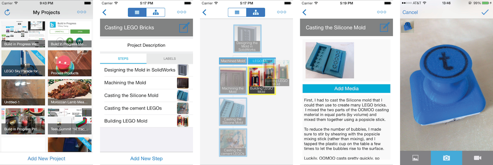

# Build-in-Progress-iOS
This repo is an open source version of the Build in Progress iOS application, to be used alongside an instance of the [Build in Progress Web Application](https://github.com/ttseng/Build-in-Progress-Web).   

Features included in the Build in Progress iOS application include:

* Camera and Video interface for capturing and uploading multiple media files at once
* Drag and drop interface for creating branches in BiP projects
* Project and step editing

To use, edit the `BIP/bip-iOS/Constants.m` file with the URLs for your web application and build in XCode.
